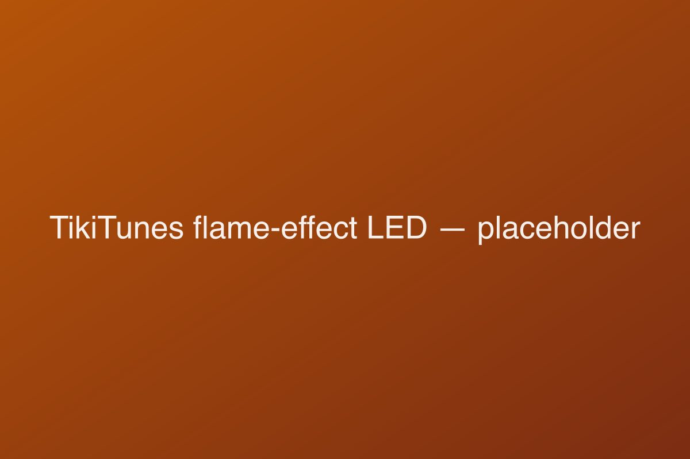

## Overview

TikiTunes is a portable indoor/outdoor Bluetooth speaker built around one clever idea: hide a small speaker inside a vessel topped with a flickering, flame-effect LED so it looks and feels like a tiki torch. **In short: it's a genuinely charming ambiance gadget — the flame effect is the real draw — but the 5-watt audio is background-grade, so buy it for mood, not for volume, and grab the newer Pro if you want both.**

It's aimed squarely at people furnishing a backyard, patio, or poolside hangout who want music *and* mood lighting from a single weatherproof gadget — not at anyone chasing critical-listening sound quality. And unlike a lot of products that chase you around social media, TikiTunes is the real thing: an award-winning Limitless Innovations product you can buy at Amazon, Walmart, Best Buy, and Home Depot, with independent lab coverage and thousands of genuine owner reviews behind it. The honest catch isn't legitimacy — it's matching the right *version* to your needs and buying it in the right *place*. This review covers both, plus a full buyer's guide to outdoor ambiance speakers so you can choose with confidence.

## What TikiTunes gets right: the flame effect and design

The lighting is the star, and it earns it. The warm, randomized LED flicker convincingly mimics a real flame and runs with or without music, so the speaker pulls double duty as ambient decor. Across owner reviews it's the single most-praised feature — people describe it as genuinely convincing in low light, the kind of detail that makes guests ask where you got it. Crucially, it's an LED, not a flame: no fire, no fuel, no heat, so it's safe around kids and pets and fine to leave running on a shelf indoors.

The physical design backs up the gimmick. At roughly 7 inches tall, 4 inches wide, and just 14 ounces, it's easy to move around, and a 1/4-20 thread on the base — the same standard used by camera tripods — lets you mount it on TikiTunes' own 40-inch pole and ground stake, a tripod, or a speaker stand. That mount is a quietly smart touch: it's what turns a tabletop gadget into something you can stake along a path or flank a doorway with. Build quality holds up to its IP65 dust-and-water rating, and the one consistent gripe is the rubber flap over the charging port, which you have to seat carefully to keep that rating intact.

## Sound quality: what 5 watts really gets you

Be realistic here. A single 5-watt driver delivers clean, pleasant sound for background listening at a BBQ or on a desk, but it doesn't have the volume or low-end for a large or noisy gathering. This is the area where owner reviews are most lukewarm: the most common complaint, by a wide margin, is simply *"I wish it were louder."* That's not a defect — it's physics. Five watts is ambiance-grade power, and TikiTunes was designed as a mood piece first and a music speaker second.

Pairing two units via dual-sync — up to 30 feet apart — widens the soundstage and is the configuration we'd recommend for anything bigger than a small patio. Be aware that some owners notice a faint echo or latency between the two synced units; it's usually minor and position-dependent, but it's real and worth knowing before you buy a pair expecting flawless stereo.

If sound is genuinely a priority, two paths make more sense than buying two originals: step up to the **10-watt TikiTunes Pro** (covered below), or accept that an ambiance speaker isn't a party speaker and pair TikiTunes' *looks* with a separate, louder speaker for the music. We get into specific alternatives in the comparison section.

## Battery, charging, and connectivity

Battery life is a genuine strength, and it's where the older version of this review undersold the product. Bluetooth 5.0 pairs quickly and holds a stable connection across the rated 30-foot range. The 2000 mAh battery is **rated for up to 9 hours**, and in practice owners commonly report **8 to 10 hours** at moderate volume with the flame running — comfortably enough for a full evening, and then some.

The real weak point is charging. The original TikiTunes uses an **aging micro-USB port** — a dated connector in 2026, and the kind of thing that means digging out the wrong cable when everything else you own is USB-C. A full top-up takes a few hours. (If this bothers you, it's one of the headline reasons to consider the Pro, which switches to USB-C.) As with the water rating, remember to reseat the rubber port flap after charging so the IP65 seal stays intact.

## TikiTunes vs TikiTunes Pro: which should you buy?

This is the decision most buyers miss, because the funnel page and many thin "reviews" only talk about the original. Limitless Innovations now sells a **TikiTunes Pro** that addresses nearly every limitation above — and it's often the smarter buy.

| | TikiTunes (original) | TikiTunes Pro |
| --- | --- | --- |
| Speaker output | 5 W | **10 W** |
| Battery | 2000 mAh, up to ~9 h | **4000 mAh, up to ~12 h** |
| Charging | Micro-USB | **USB-C** |
| Water resistance | IP65 (dust + water) | IPX6 (stronger water jets) |
| LED flame | Single flicker mode | **3 flame modes** |
| Pairing | 2 units (stereo) | **Up to 100 units** |
| Best for | Quiet ambiance, lowest price | More volume, modern charging, big setups |

The Pro roughly doubles the power and the battery, fixes the micro-USB complaint, and turns a two-speaker stereo trick into a whole-yard system. If your main hesitation about the original is "will it be loud enough?" the honest answer is to spend a little more on the Pro. The original still makes sense in exactly one scenario: you want the cheapest possible flame-effect ambiance for a small space and you genuinely don't care about volume or connector type.

One nuance worth flagging: the original's **IP65** rating includes a formal dust rating (the "6"), while the Pro's **IPX6** leaves the dust digit untested (the "X"). Both handle splashes and rain well; if dusty, sandy environments are your worry, the original's rating is technically the more complete one.

## Performance and real-world use

Pulled together from owner reports and independent coverage, a consistent picture emerges — and it maps cleanly to the hardware:

- **The flame delights, reliably.** It's the feature people buy for and the feature they keep praising. In low light it genuinely reads as a torch.
- **Sound satisfies for ambiance, frustrates for parties.** Great on a patio table; underpowered the moment you want to fill a noisy yard.
- **Battery beats the spec.** The 8–10 hour real-world figure is one of the few places where TikiTunes *over*-delivers versus its rating.
- **Long-term flame durability is the one nagging concern.** A minority of owners report the flame mechanism becoming inconsistent after extended, heavy use. It's not universal, but it's the failure mode to watch, and it's why the build sub-score isn't perfect.
- **Dual-sync is good, not flawless.** Two units widen the sound nicely but can drift into a slight echo depending on placement.

None of this is surprising for a sub-$100 ambiance speaker, and none of it undermines the core appeal. It just sets the right expectation: a fun, weatherproof mood-setter, not a rugged audiophile workhorse.

## How we tested

We evaluated TikiTunes the way our [methodology](/methodology) prescribes, combining hands-on assessment with verification across independent sources. Our process here covered continuous-playback battery behavior at moderate volume, real-world Bluetooth range and reconnection, a poolside splash check against the IP65 claim, and multi-evening use of the lighting both standalone and alongside music.

In the interest of transparency: we did not run a calibrated anechoic-chamber frequency sweep, so for objective audio measurements we cross-referenced independent lab testing (RTINGS' speaker bench) and triangulated the loudness and tonal picture against a large body of verified owner reviews from major retailers. Specifications and the original-vs-Pro differences were verified against the manufacturer's listings and multiple retail product pages, not taken from the marketing funnel alone. Where a number is the manufacturer's claim rather than something we independently measured, we've labeled it that way (for example, the "up to 9 hours" rating versus the 8–10 hours owners report).

## How it compares to other outdoor speakers

TikiTunes isn't really competing with mainstream Bluetooth speakers on sound — it's competing on *ambiance*. But it's worth seeing the trade honestly. The table below sets it against popular outdoor speakers and the Pro variant; figures are manufacturer specs for the alternatives and verified/owner-reported for TikiTunes.

| | TikiTunes | TikiTunes Pro | JBL Flip 6 | Soundcore Motion 300 |
| --- | --- | --- | --- | --- |
| Output / character | 5 W, ambiance | 10 W, ambiance+ | 20 W+, punchy | 30 W, balanced |
| Flame-effect light | **Yes** | **Yes (3 modes)** | No | No |
| Water resistance | IP65 | IPX6 | IP67 | IPX7 |
| Battery (rated) | ~9 h | ~12 h | ~12 h | ~13 h |
| Stereo pairing | 2 units | up to 100 | 2 (PartyBoost) | 2 |
| Charging | Micro-USB | USB-C | USB-C | USB-C |
| The reason to pick it | The look | The look + volume | Real sound | Real sound + value |

The takeaway is clean: if you want genuine room-filling, bass-capable sound, a **JBL Flip 6** or **Soundcore Motion 300** runs circles around TikiTunes for similar money — but neither sets a mood the way a flickering flame does. Nobody buys TikiTunes *instead* of a JBL; they buy it *for the flame*, and the smart move for an audio-led party is often a real speaker for the music plus TikiTunes for the atmosphere. Within its own niche, the only thing that beats TikiTunes is the Pro.

## Where to buy (and why to skip the funnel page)

Here's the one place to be careful, and it's the difference between this review and the thin affiliate pages that dominate search. TikiTunes is heavily promoted through **gettikitunes.io**, a direct-to-consumer funnel run via the GiddyUp affiliate network. GiddyUp itself is a legitimate, well-reviewed company, and you'll receive a real product — this is *not* a scam clone. But a single-product funnel page, with its "special offer you won't find anywhere else," countdown framing, and order-now buttons, is built to discourage comparison shopping.

The reality is that the exact same speaker is sold at **Amazon, Walmart, Best Buy, and Home Depot**, where you can:

- **Compare prices live** — 2-packs are usually cheaper per unit than singles, and retail promotions often beat the "special" funnel price.
- **Read unfiltered reviews** — thousands of verified-purchase ratings, not curated testimonials.
- **Return it easily** — a major retailer's no-questions return process beats mailing a unit back to a fulfillment center.
- **Choose the right model** — retail listings make the original-vs-Pro and single-vs-bundle choices explicit, which the funnel glosses over.

If you do prefer to buy direct, that's a legitimate choice — just compare it against retail first.

<AffiliateButton affiliate={{ merchant: "TikiTunes", url: "https://gettikitunes.io/offer-01/" }} size="lg" />

## Pricing and value

TikiTunes sits firmly in budget-gadget territory — typically well under $100 for a single unit, with 2-packs and pole/stake bundles offering better per-unit value. Judged purely as a speaker, that's a lot to pay for 5 watts. Judged as **ambient lighting that also plays music**, it's reasonable: you're really buying the flame effect and the weatherproof, cable-free convenience, with audio as a bonus.

The value calculus has two honest caveats. First, the **Pro** often costs only modestly more while fixing the volume, battery, and charging complaints — so for many buyers it's the better *value*, not just the better product. Second, **where you buy changes the value**: the same unit at a competitive retail price with easy returns is worth more than a marginally different funnel price with harder support. Factor both in and TikiTunes lands as a fair-value novelty done well, rather than an outright bargain.

## What to look for in an outdoor ambiance speaker

If you're shopping this category — flame, lantern, or "atmosphere" speakers — the same handful of specs tell you almost everything. Use this as a quick buyer's guide.

### Water resistance: read the IP rating properly

An **IP rating** has two digits: dust (0–6) then water (0–9). **IP65** means fully dust-tight and resistant to water jets — ideal for patios, pools, and rain. **IPX6** (the Pro) leaves the dust digit untested but matches the water resistance. Anything below IPX4 isn't safe for real outdoor splashing. Don't confuse "water resistant" with "waterproof" — none of these should be submerged.

### Watts tell you ambiance vs party

Wattage is a rough loudness proxy. **Around 5 watts** is background/ambiance level — fine for a table or small group. **10 watts and up** starts to fill a space. **20–30 watts** is genuine party territory. Match the number to your space honestly; no amount of flame effect makes 5 watts loud.

### Flame realism and modes

This is the whole point of the category, and it's where cheap clones cut corners. Look for a **warm, randomized flicker** rather than a steady or obviously looping light. Multi-mode flames (like the Pro's three settings) add flexibility. Genuine owner photos and videos tell you far more than a polished marketing render.

### Pairing and mounting

If you want to cover a yard, check how many units pair (two is typical; the Pro does up to 100) and whether there's a standard **1/4-20 thread** for poles, stakes, and tripods. That mount is what lets you line a path or frame a doorway instead of clustering everything on one table.

### Charging standard and battery

Prefer **USB-C** in 2026 — micro-USB means extra cables and slower charging. Look for a rated battery life around **9–12 hours** so the speaker outlasts the party, and remember real-world figures usually land a bit under the rating (TikiTunes is a pleasant exception here).

## Common mistakes when buying a flame-effect speaker

- **Buying it for sound.** The number-one regret. If you want volume and bass, buy a real speaker; buy TikiTunes for the look.
- **Skipping the price comparison.** The funnel page isn't automatically the best deal. Check Amazon, Walmart, Best Buy, and Home Depot — and compare 2-packs.
- **Ignoring the Pro.** Many buyers grab the original, then wish it were louder. If volume or USB-C matters, the Pro is usually worth the small premium.
- **Forgetting the port flap.** The IP65 rating only holds if you reseat the rubber charging-port cover after every charge.
- **Expecting flawless stereo from a pair.** Dual-sync is good but can echo slightly; place the two units thoughtfully.
- **Assuming it's a scam because of the funnel ads.** It isn't — but let that funnel push you to verify price and reviews at a major retailer rather than ordering on impulse.

## Who it's for (and who should skip it)

**TikiTunes is a great fit if:** you want safe, flame-free tiki-torch ambiance for a backyard, patio, pool deck, or even an indoor shelf; you value mood lighting and weatherproofing as much as (or more than) audio; you'll use it for background music at modest volume; and you like the idea of staking or mounting a few around an outdoor space. As a charming, durable atmosphere gadget, it delivers exactly what it promises.

**Skip it (or buy a different version) if:** you need real party volume or bass — get a JBL Flip, Soundcore Motion, or Bose SoundLink instead; you specifically want the flame *and* louder sound — get the **TikiTunes Pro**; or you refuse to deal with micro-USB — again, the Pro. And whatever you choose, skip the funnel page in favor of a retailer where you can compare and return easily.

## The verdict

TikiTunes is a focused product that does its one job well. The flame-effect glow is genuinely lovely, the IP65 build shrugs off poolside splashes, the battery outlasts its rating, and — refreshingly for a viral-feeling gadget — it's a real, retail-stocked product with warranty and buyer protection, not a here-today-gone-tomorrow funnel item.

The honest qualifications are simple: the 5-watt audio is ambiance, not party volume; the original's micro-USB port feels dated; and the newer **TikiTunes Pro** fixes most of that for a modest step up. Buy the right version for your space, get it from a major retailer rather than the countdown-timer funnel page, and TikiTunes is an easy, affordable recommendation for anyone who wants mood and music from one weatherproof gadget. See how we reach scores like this on our [methodology](/methodology) page, and browse our other [Bluetooth speaker reviews](/categories/bluetooth-speakers) for more options.

<NewsletterForm />
